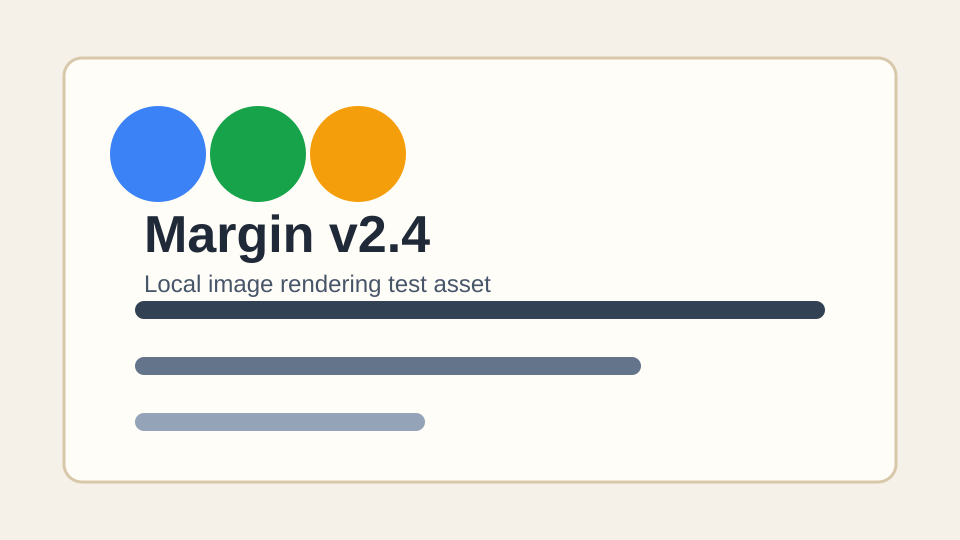
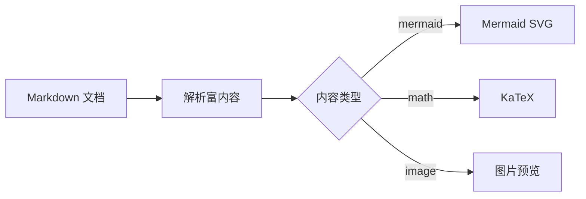
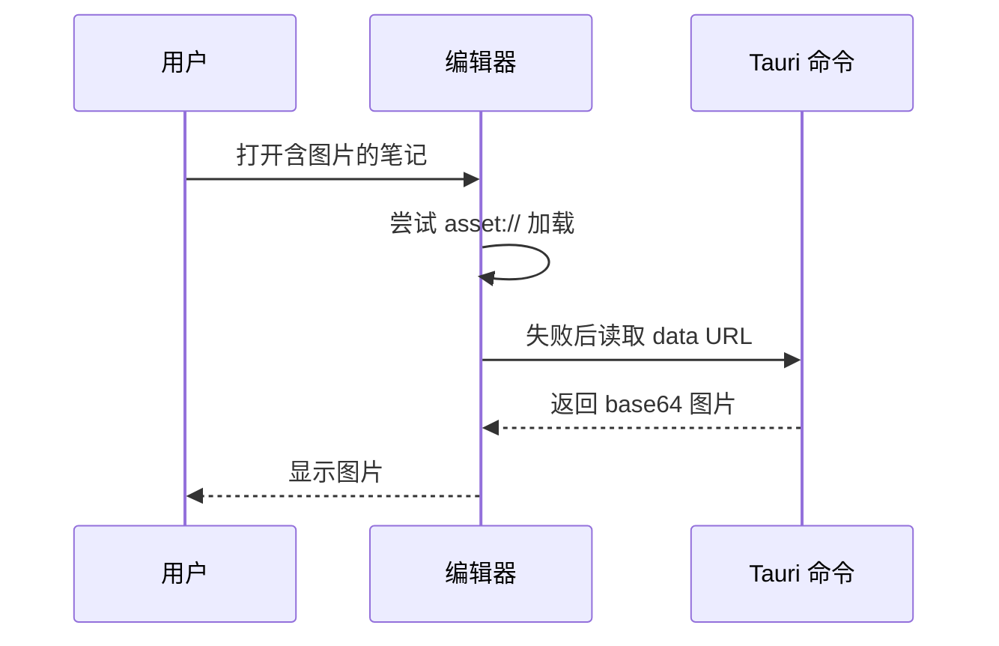
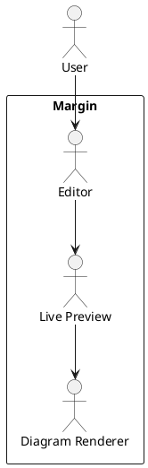

# Margin v2.4 富内容测试文档

这份文档用于验证 v2.4 富内容扩展。建议在 Margin 里打开本文件，逐段检查 live preview 表现。

## 1. 图片渲染

普通本地图片：

带宽度控制：

另一种尺寸语法：

## 2. Mermaid 图表

## 3. PlantUML / Kroki 图表

## 4. 数学公式

行内公式：当 $a^2 + b^2 = c^2$ 时，可以用 KaTeX 渲染。

块级公式：

$$
\int_0^1 x^2 dx = \frac{1}{3}
$$

$$
E = mc^2
$$

## 5. Callout

> [!note] 普通提示
> 这是一个 note callout，用于验证标题和正文渲染。

> [!warning] 注意事项
> 远程图表需要网络或可访问的图表服务地址。

> [!tip]- 折叠提示
> 这一段用于验证折叠 callout 的显示状态。

## 6. 高亮语法

这是一段普通文本，其中 ==这部分应该显示为高亮==，后面继续显示普通文本。

## 7. 音视频嵌入

远程视频：

远程音频：

## 8. 混合内容回归

- [ ] 图片加载
- [ ] Mermaid 渲染
- [ ] PlantUML / dot 渲染
- [ ] 数学公式渲染
- [ ] Callout 渲染
- [ ] 高亮渲染
- [ ] 音视频控件渲染

如果光标进入源码区域，对应内容应恢复为可编辑 Markdown；光标离开后应恢复富内容预览。
